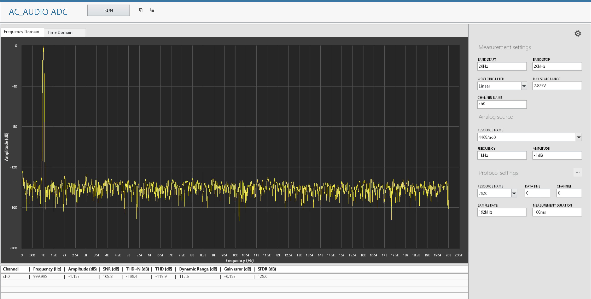

# Audio ADC - LabVIEW

## Overview

"audio-adc-labview" is a MeasurementLink LabVIEW plugin for making measurements for Audio ADC's.

This plugin generates analog signal and measures the digital audio output of the ADC

## Key Features

 - Generates analog audio signal supporting below protocols
   - I2S
   - Left Justified
   - Right Justified
   - TDM
 
 - Single tone measurements
   - THD
   - THD+N
   - SNR
   - SFDR
   - Dynamic range
   - Gain error

## Software Dependencies
- NI-DAQmx (2022 Q3 or higher)
- NI-Digital Audio Acquisition and Generation Toolkit (2023 Q4 or higher)
- NI-DCPower (2023 Q1 or version as recommended by Instrument Studio)
- LabVIEW Sound and Vibration Toolkit (2021 or higher) - License Activation required
- LabVIEW Runtime Engine (2021 SP1)
- InstrumentStudio (2023 Q3 or higher)
- Measurement Link (2023 Q4 or higher)

## Getting Started
When you are ready to start using the software, check out [this](docs/help.md).

## Contributing
Use the instructions in [software development](docs/software-development.md) for setting up a development environment and overview of the code.

